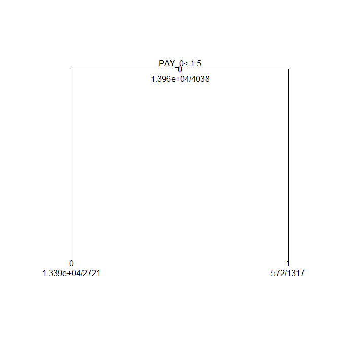
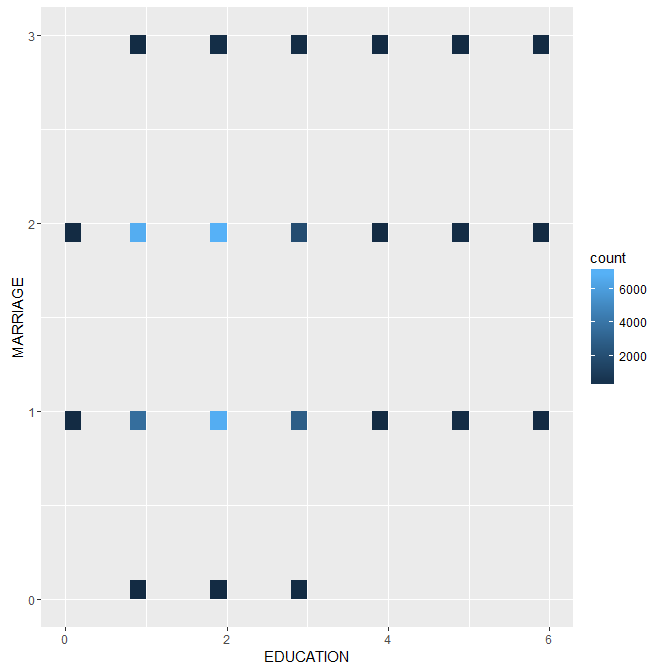
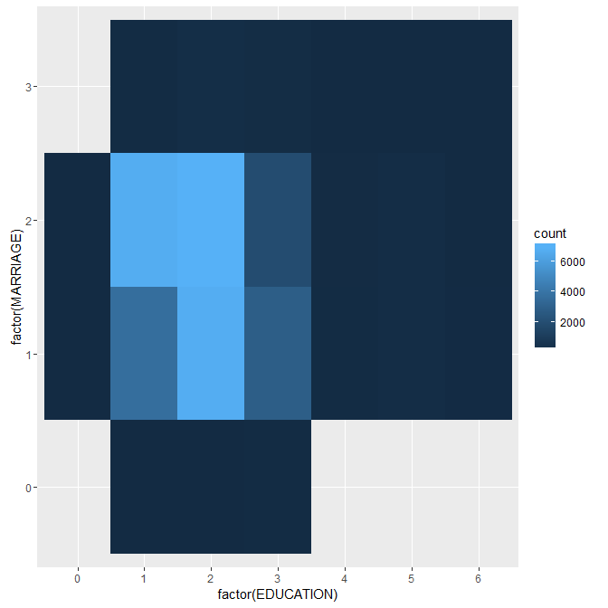
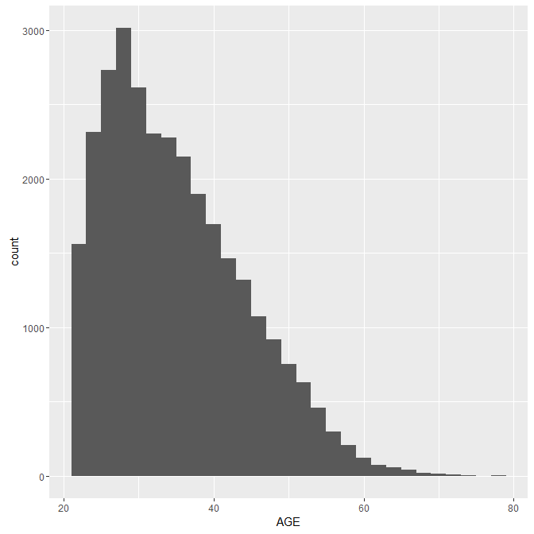
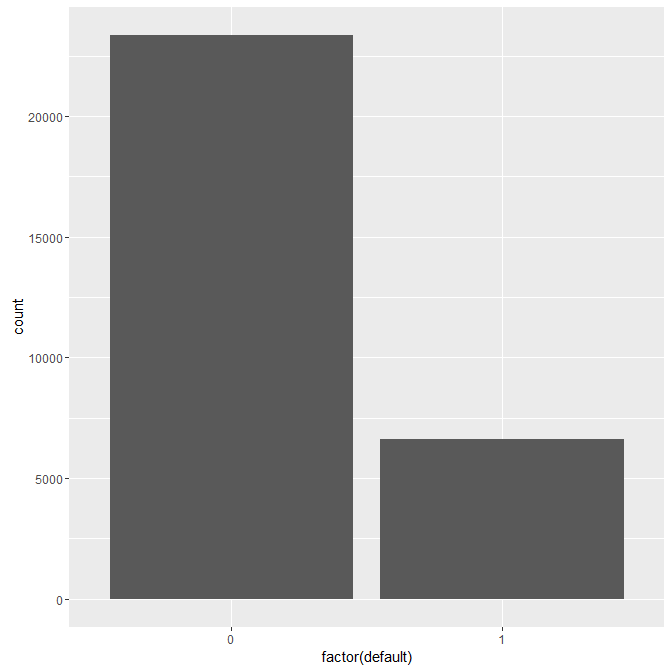

# Oracle R超入門 : Wed Sep 14 17:49:37 JST 2016
## ダウンロード
- https://cran.r-project.org/

## 使用スライド
- http://www.slideshare.net/OgawaMIKIO/r-63470545
    - リンク切れならこっち
        - [r-160627044802.pptx](r-160627044802.pptx "r-160627044802.pptx")

## 使用テストデータ
- https://goo.gl/Bo6KBr
    - original data: default of credit card clients Data Set
        - http://archive.ics.uci.edu/ml/datasets/default+of+credit+card+clients
    - リンク切れならこっち
        - [creditdefault.csv](creditdefault.csv "creditdefault.csv")

## R概要

- 言語？　->　統合環境っすね。 (R studio ってのがあるらしい: www.rstudio.com)
- GNUライセンス
- 言語タイプ：独自（手続きっぽいし、関数っぽいし）
- パッケージ数がめちゃ多い
- [Kaggle](https://www.kaggle.com "Kaggle") (解析系のSNS?）: で人気だ!

### R vs Python

- Rのほうが給料良い
- でも、RとPython両方使える人が半数近く
- 使いみち
    - 解析・レポートならR
    - ＋アプリ・制御ならPython
- R は ``R static`` とか ``R analystic`` とかでググれ！

### パッケージインストール
```
install.packages("ggplot2", dep=T)
```

- dep: は依存関係も一緒にinstallするかどうか

## 導入
### 変数

```sh
> x = "TEST"
> x
[1] "TEST"
> print(x)
[1] "TEST"
> 
> x <- 825
> x
[1] 825
> 826 -> x
> x
[1] 826
> 826 = x
 826 = x でエラー:  代入の左辺が不正 (do_set) です 
```

### 演算

```sh
> x <- 16
> > 1 + 2 * 3 / 4
> [1] 2.5
> > 4 ^ 2
> [1] 16
> > y <- x * 2
> > y
> [1] 32
```

### 関数

- 大概用意されてる。

```sh
> sqrt(4)
> [1] 2
> > 4^(1/2)
> [1] 2
> > sqrt(2)
> [1] 1.414214
> > log(10)
> [1] 2.302585
> > cos(pi/3)
> [1] 0.5
```

### ベクトル (配列)

- c(a, b, c, ...): でベクトル
- cって変数と区別が。。。って気にしない事
- 文字、数値の混合は出来ない

```sh
> v <- c(1,2,3)
> v
[1] 1 2 3
> length(v)
[1] 3
> c(1:6)
[1] 1 2 3 4 5 6
> c (1,2,"a")
[1] "1" "2" "a"
> v[1]
[1] 1
> v[-1]
[1] 2 3
> v[c(1,2)]
[1] 1 2
> v[c(2,3)]
[1] 2 3
```

### データフレーム　（構造体みたいな）

- ベクトルは列ベクトルとして扱って、列を増やす感じ
- パラメータ指定は ``=`` を使うべし

#### 定義
```sh
> df <- data.frame(ID = c(1:3), Name = c("OGAWA", "NAKAJIMA", "TAKETSUME"))
> df
ID      Name
1  1     OGAWA
2  2  NAKAJIMA
3  3 TAKETSUME
> 
```

#### 参照
```sh
> df$ID
[1] 1 2 3
> df[1,]
  ID  Name
1  1 OGAWA
> df[,2]
[1] OGAWA     NAKAJIMA  TAKETSUME
Levels: NAKAJIMA OGAWA TAKETSUME        # Lvelsってのは一覧って事らしい
> df[1,-2]
[1] 1
> df[2,]
  ID     Name
2  2 NAKAJIMA
> df[3,]
  ID      Name
3  3 TAKETSUME
> df[4,]
   ID Name
NA NA <NA>
```

### factor (ラベル) タイプ
- factor() を使うとラベルとして扱ってくれる模様
- 数値のままだったり、文字のままだったりすると、それ向けの解析になるのでラベリングの種類は明示的に示したほうが良さそう。


```sh
> v <- c(1,2,3)
> v
[1] 1 2 3
> x <- factor(c(1,0,99))
> x
[1] 1  0  99
Levels: 0 1 99      # 数値じゃないのでLvelsが出てる
> x[1]
[1] 1
Levels: 0 1 99
```

## 実践
### CSV読もう
- データ: https://goo.gl/Bo6KBr
    - original data: default of credit card clients Data Set
        - http://archive.ics.uci.edu/ml/datasets/default+of+credit+card+clients
    - リンク切れならこっち
        - [creditdefault.csv](creditdefault.csv, "creditdefault.csv")

```sh
> getwd()
[1] "C:/Users/yamaoka.takio.MEGACHIPS/Documents"        # ディレクトリ変更は setwd("c:/usr")
> df_default <- read.table("creditdefault.csv",
+ skip = 1, header = T, sep = ",")
> head(df_default)
  LIMIT_BAL SEX EDUCATION MARRIAGE AGE PAY_0 PAY_2 PAY_3 PAY_4 PAY_5 PAY_6 BILL_AMT1 BILL_AMT2 BILL_AMT3 BILL_AMT4
1     20000   2         2        1  24     2     2    -1    -1    -2    -2      3913      3102       689         0
2    120000   2         2        2  26    -1     2     0     0     0     2      2682      1725      2682      3272
3     90000   2         2        2  34     0     0     0     0     0     0     29239     14027     13559     14331
4     50000   2         2        1  37     0     0     0     0     0     0     46990     48233     49291     28314
5     50000   1         2        1  57    -1     0    -1     0     0     0      8617      5670     35835     20940
6     50000   1         1        2  37     0     0     0     0     0     0     64400     57069     57608     19394
  BILL_AMT5 BILL_AMT6 PAY_AMT1 PAY_AMT2 PAY_AMT3 PAY_AMT4 PAY_AMT5 PAY_AMT6 default
1         0         0        0      689        0        0        0        0       1
2      3455      3261        0     1000     1000     1000        0     2000       1
3     14948     15549     1518     1500     1000     1000     1000     5000       0
4     28959     29547     2000     2019     1200     1100     1069     1000       0
5     19146     19131     2000    36681    10000     9000      689      679       0
6     19619     20024     2500     1815      657     1000     1000      800       0
> summary(df_default)
   LIMIT_BAL            SEX          EDUCATION        MARRIAGE          AGE            PAY_0        
 Min.   :  10000   Min.   :1.000   Min.   :0.000   Min.   :0.000   Min.   :21.00   Min.   :-2.0000  
 1st Qu.:  50000   1st Qu.:1.000   1st Qu.:1.000   1st Qu.:1.000   1st Qu.:28.00   1st Qu.:-1.0000  
 Median : 140000   Median :2.000   Median :2.000   Median :2.000   Median :34.00   Median : 0.0000  
 Mean   : 167484   Mean   :1.604   Mean   :1.853   Mean   :1.552   Mean   :35.49   Mean   :-0.0167  
 3rd Qu.: 240000   3rd Qu.:2.000   3rd Qu.:2.000   3rd Qu.:2.000   3rd Qu.:41.00   3rd Qu.: 0.0000  
 Max.   :1000000   Max.   :2.000   Max.   :6.000   Max.   :3.000   Max.   :79.00   Max.   : 8.0000  
     PAY_2             PAY_3             PAY_4             PAY_5             PAY_6           BILL_AMT1      
 Min.   :-2.0000   Min.   :-2.0000   Min.   :-2.0000   Min.   :-2.0000   Min.   :-2.0000   Min.   :-165580  
 1st Qu.:-1.0000   1st Qu.:-1.0000   1st Qu.:-1.0000   1st Qu.:-1.0000   1st Qu.:-1.0000   1st Qu.:   3559  
 Median : 0.0000   Median : 0.0000   Median : 0.0000   Median : 0.0000   Median : 0.0000   Median :  22382  
 Mean   :-0.1338   Mean   :-0.1662   Mean   :-0.2207   Mean   :-0.2662   Mean   :-0.2911   Mean   :  51223  
 3rd Qu.: 0.0000   3rd Qu.: 0.0000   3rd Qu.: 0.0000   3rd Qu.: 0.0000   3rd Qu.: 0.0000   3rd Qu.:  67091  
 Max.   : 8.0000   Max.   : 8.0000   Max.   : 8.0000   Max.   : 8.0000   Max.   : 8.0000   Max.   : 964511  
   BILL_AMT2        BILL_AMT3         BILL_AMT4         BILL_AMT5        BILL_AMT6          PAY_AMT1     
 Min.   :-69777   Min.   :-157264   Min.   :-170000   Min.   :-81334   Min.   :-339603   Min.   :     0  
 1st Qu.:  2985   1st Qu.:   2666   1st Qu.:   2327   1st Qu.:  1763   1st Qu.:   1256   1st Qu.:  1000  
 Median : 21200   Median :  20089   Median :  19052   Median : 18105   Median :  17071   Median :  2100  
 Mean   : 49179   Mean   :  47013   Mean   :  43263   Mean   : 40311   Mean   :  38872   Mean   :  5664  
 3rd Qu.: 64006   3rd Qu.:  60165   3rd Qu.:  54506   3rd Qu.: 50191   3rd Qu.:  49198   3rd Qu.:  5006  
 Max.   :983931   Max.   :1664089   Max.   : 891586   Max.   :927171   Max.   : 961664   Max.   :873552  
    PAY_AMT2          PAY_AMT3         PAY_AMT4         PAY_AMT5           PAY_AMT6           default      
 Min.   :      0   Min.   :     0   Min.   :     0   Min.   :     0.0   Min.   :     0.0   Min.   :0.0000  
 1st Qu.:    833   1st Qu.:   390   1st Qu.:   296   1st Qu.:   252.5   1st Qu.:   117.8   1st Qu.:0.0000  
 Median :   2009   Median :  1800   Median :  1500   Median :  1500.0   Median :  1500.0   Median :0.0000  
 Mean   :   5921   Mean   :  5226   Mean   :  4826   Mean   :  4799.4   Mean   :  5215.5   Mean   :0.2212  
 3rd Qu.:   5000   3rd Qu.:  4505   3rd Qu.:  4013   3rd Qu.:  4031.5   3rd Qu.:  4000.0   3rd Qu.:0.0000  
 Max.   :1684259   Max.   :896040   Max.   :621000   Max.   :426529.0   Max.   :528666.0   Max.   :1.0000  
```

### モデル構築
1. データ集める
1. 学習用とテスト用を分ける。

```sh
> dim(df_default)
[1] 30000    24
> nrow(df_default)
[1] 30000
# テストデータとして全データの4割のインデックスをランダムで取ります
> indexes <- sample(1:nrow(df_default), size=0.4*nrow(df_default))
# 残りは学習用
> test <- df_default[indexes,]
> train <- df_default[-indexes,]
> nrow(test)
[1] 12000
> nrow(train)
[1] 18000
> head(indexes)
[1] 18467 23587 20146 15009 19912  7452
```

### モデル作ろう！
- 決定木 (rpart) (install 必要だったかは忘れた)
- 引数には、``予測対象列~予測に使用する列1+列2+...`` なんだけど...
    - ``予測対象列~.`` で、``予測対象列``、と``それ以外は予測に使用する``って指定になる

#### 学習
```sh
> library(rpart)
# default ってラベルが予測対象
> rp <- rpart(factor(default)~., data=train)
> print(rp)
n= 18000 

node), split, n, loss, yval, (yprob)
      * denotes terminal node

# ツリーの構成
1) root 18000 3974 0 (0.7792222 0.2207778)  
  2) PAY_0< 1.5 16091 2651 0 (0.8352495 0.1647505) *
  3) PAY_0>=1.5 1909  586 1 (0.3069670 0.6930330) *
> 
# R標準のプロット (正直、よく解ってない。。。
> plot(rp, margin=0.1)
> text(rp, all=T, use.n=T)
```



#### テスト

実は内容が良くわかってない（追いつくのに必死でした。

```sh
> pre <- predict(rp, test, type="class")
> tes <- test[,24]
> table(tes,pre)
   pre
tes    0    1
  0 9021  381
  1 1738  860
```

### ランダムフォレスト
- 決定木を複数集めて、多数決
- randomForest ってライブラリを使う（多分 install 必要
- 細かいところは、調べてみよう！

```sh
> library(randomForest)
randomForest 4.6-12
Type rfNews() to see new features/changes/bug fixes.
> rf <- randomForest(factor(default)~., data=train, importance=T)
> print(rf)

Call:
 randomForest(formula = factor(default) ~ ., data = train, importance = T) 
               Type of random forest: classification
                     Number of trees: 500
No. of variables tried at each split: 4

        OOB estimate of  error rate: 18.59%
Confusion matrix:
      0    1 class.error
0 13176  786  0.05629566
1  2560 1478  0.63397722
```
# Rのグラフ
## ggplot2
- デファクトスタンダード！
- 以下、決定木の続き

```
> base1 <- ggplot(df_default,
+ aes(x=EDUCATION, y=MARRIAGE))
> base1
> points1 <- base1 + geom_bin2d()
> points1
```



```
> base1 <- ggplot(df_default,
+ aes(x=factor(EDUCATION), y=factor(MARRIAGE)))
> base1
> points1 <- base1 + geom_bin2d()
> points1
```



```
> base3 <- ggplot(df_default, aes(AGE))
> base3
> pints3 <- base3 + geom_histogram()
> pints3
`stat_bin()` using `bins = 30`. Pick better value with `binwidth`.
```



```
> base4 <- ggplot(df_default, aes(factor(default)))
> base4
> points4 <- base4 + geom_bar()
> points4
> points4 <- base4 + geom_histogram()
> points4
 エラー: StatBin requires a continuous x variable the x variable is discrete. Perhaps you want stat="count"?
> points4 <- base4 + geom_bar()
> points4
>
```



# その他
- Oracle R engine

- Top 20 R Machine Learing and Data Science pakcages
    - xgboostが人気（ブースティング）
- CRAN Task View:
- Deep
    - H2O
    - MXNet
- [Kaggle](https://www.kaggle.com "Kaggle"): 解析コンテスト
- ef-prime R AnalyticFlow

- 教則本
    - みんなのR
    - Rによるデータサイエンス-データ解析の基礎から最新手法まで
        - PDFなら無料版があるらしい。（未確認
